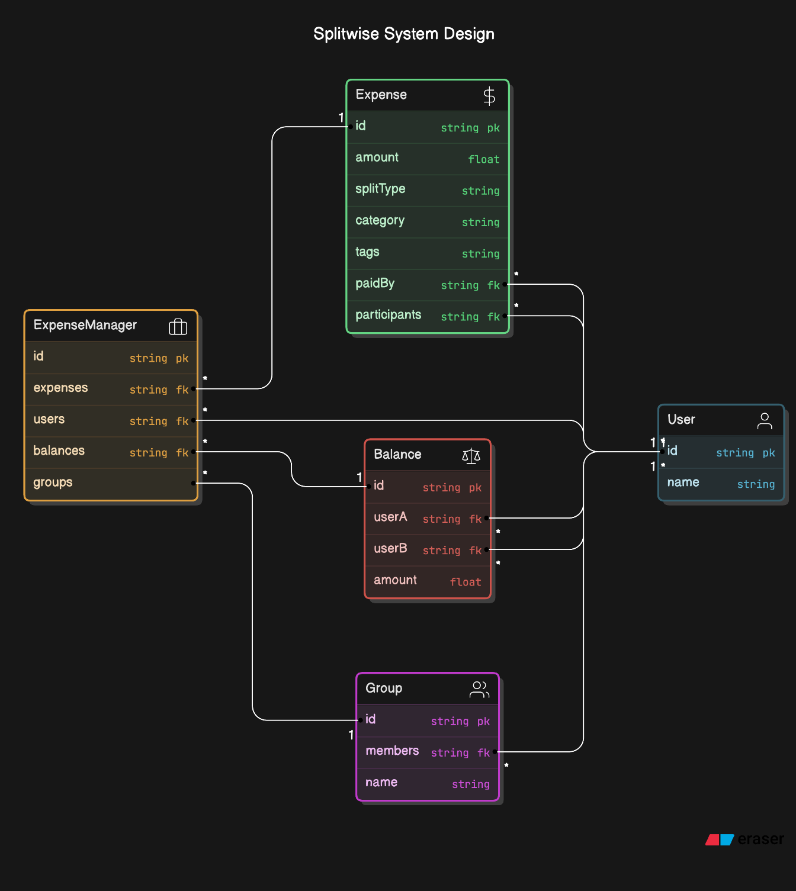

# Splitwise - Low Level System Design


Great! Let's break down the low-level design for building a simplified version of Splitwise, where users can split expenses among a group. We’ll build it in JavaScript, focusing on the essential components, data structures, and core logic.

---



---
### Core Requirements
1. **User Management**: Add, view, and manage users.
2. **Expense Management**: Add expenses, and keep track of who owes whom.
3. **Balance Management**: Maintain and calculate balances for each user.

### Design Approach

We'll focus on classes and modular design:
1. **User**: Represents a user in the system.
2. **Expense**: Represents an individual expense with information about the payer and the participants.
3. **ExpenseManager**: Manages all users, expenses, and balances.

### Data Structures

1. **User**: 
    ```javascript
    class User {
        constructor(id, name) {
            this.id = id;
            this.name = name;
        }
    }
    ```
   
2. **Expense**:
    - Stores who paid, the total amount, and how much each user owes.
    - Can handle different split types like equal, exact, or percentage.
   
    ```javascript
    class Expense {
        constructor(id, amount, paidBy, participants, splitType) {
            this.id = id;
            this.amount = amount;
            this.paidBy = paidBy;
            this.participants = participants; // Array of {userId, amountOwed}
            this.splitType = splitType;
        }
    }
    ```

3. **ExpenseManager**:
    - Holds a list of users, expenses, and a balance map.
    - Keeps a record of how much each user owes to others.

    ```javascript
    class ExpenseManager {
        constructor() {
            this.users = {}; // Stores users by user ID
            this.expenses = []; // List of all expenses
            this.balances = {}; // Nested map, e.g., balances[userA][userB] = amount
        }

        addUser(id, name) {
            const user = new User(id, name);
            this.users[id] = user;
            this.balances[id] = {};
        }

        addExpense(amount, paidBy, participants, splitType) {
            const expense = new Expense(this.expenses.length + 1, amount, paidBy, participants, splitType);
            this.expenses.push(expense);

            this._updateBalances(expense);
        }

        _updateBalances(expense) {
            const { amount, paidBy, participants } = expense;
            
            participants.forEach(participant => {
                if (paidBy !== participant.userId) {
                    const amountOwed = participant.amountOwed;
                    this.balances[paidBy][participant.userId] = (this.balances[paidBy][participant.userId] || 0) + amountOwed;
                    this.balances[participant.userId][paidBy] = (this.balances[participant.userId][paidBy] || 0) - amountOwed;
                }
            });
        }

        getBalance(userId) {
            const userBalance = this.balances[userId];
            return Object.entries(userBalance).map(([otherUserId, amount]) => {
                return { otherUserId, amount };
            });
        }
    }
    ```

### Example Usage

```javascript
const expenseManager = new ExpenseManager();

// Adding Users
expenseManager.addUser(1, "Alice");
expenseManager.addUser(2, "Bob");
expenseManager.addUser(3, "Charlie");

// Adding Expense
// Alice pays $300, split equally among Alice, Bob, and Charlie
expenseManager.addExpense(300, 1, [
    { userId: 1, amountOwed: 100 },
    { userId: 2, amountOwed: 100 },
    { userId: 3, amountOwed: 100 }
], "EQUAL");

// Viewing Balances
console.log(expenseManager.getBalance(1)); // Alice's balance
console.log(expenseManager.getBalance(2)); // Bob's balance
console.log(expenseManager.getBalance(3)); // Charlie's balance
```

### Enhancements and Further Development
1. **Split Types**: Add options for exact or percentage splits.
2. **Simplify Balances**: Implement a method to "settle up" by simplifying balances.
3. **Testing**: Set up unit tests to ensure each component functions as expected.

This structure is flexible for adding more complex features as needed, such as recurring expenses, detailed reporting, or friend groups. Let me know if you'd like to implement a specific feature in more detail!

---

To enhance our Splitwise-like implementation, let’s add three new features:

1. **Different Split Types** (Equal, Exact, and Percentage).
2. **Simplify Balances** (Calculate a minimal number of transactions needed to settle debts).
3. **Testing** (Simple unit tests for each component).

Let’s build each feature step-by-step.

---

### Step 1: Add Different Split Types

First, let’s modify the `Expense` class and the `ExpenseManager` class to handle three split types: **Equal**, **Exact**, and **Percentage**.

#### 1.1 Update `Expense` Class for Split Types

We'll add a method to calculate how much each participant owes based on the split type.

```javascript
class Expense {
    constructor(id, amount, paidBy, participants, splitType) {
        this.id = id;
        this.amount = amount;
        this.paidBy = paidBy;
        this.participants = participants;
        this.splitType = splitType;
    }

    calculateSplit() {
        const totalParticipants = this.participants.length;
        switch (this.splitType) {
            case "EQUAL":
                const equalAmount = this.amount / totalParticipants;
                this.participants.forEach(participant => {
                    participant.amountOwed = equalAmount;
                });
                break;

            case "EXACT":
                // For exact splits, assume `amountOwed` is provided in each participant entry.
                break;

            case "PERCENTAGE":
                this.participants.forEach(participant => {
                    participant.amountOwed = (this.amount * participant.percentage) / 100;
                });
                break;

            default:
                throw new Error("Invalid split type");
        }
    }
}
```

Now, before an expense is added to the `ExpenseManager`, we call `calculateSplit()` to ensure `amountOwed` for each participant is set based on the split type.

#### 1.2 Modify `ExpenseManager` to Handle Different Splits

Update `addExpense` in `ExpenseManager` to invoke `calculateSplit()`.

```javascript
class ExpenseManager {
    constructor() {
        this.users = {}; // Stores users by user ID
        this.expenses = []; // List of all expenses
        this.balances = {}; // Nested map, e.g., balances[userA][userB] = amount
    }

    addUser(id, name) {
        const user = new User(id, name);
        this.users[id] = user;
        this.balances[id] = {};
    }

    addExpense(amount, paidBy, participants, splitType) {
        const expense = new Expense(this.expenses.length + 1, amount, paidBy, participants, splitType);
        expense.calculateSplit(); // Calculate split based on type
        this.expenses.push(expense);

        this._updateBalances(expense);
    }

    _updateBalances(expense) {
        const { paidBy, participants } = expense;

        participants.forEach(participant => {
            if (paidBy !== participant.userId) {
                const amountOwed = participant.amountOwed;
                this.balances[paidBy][participant.userId] = (this.balances[paidBy][participant.userId] || 0) + amountOwed;
                this.balances[participant.userId][paidBy] = (this.balances[participant.userId][paidBy] || 0) - amountOwed;
            }
        });
    }
}
```

### Step 2: Implement Simplify Balances

We'll create a method to **simplify balances**, which will reduce the number of transactions needed to settle debts. This involves identifying which users have outstanding balances and trying to minimize transfers by offsetting debts.

#### 2.1 Add a Simplify Balances Method

In this approach, we'll use a greedy algorithm: find people with the highest debt and the highest credit, then try to match them to minimize transactions.

```javascript
class ExpenseManager {
    // Other methods...

    simplifyBalances() {
        const netBalances = {};

        // Calculate net balances for each user
        for (const userId in this.balances) {
            netBalances[userId] = 0;
            for (const otherUserId in this.balances[userId]) {
                netBalances[userId] += this.balances[userId][otherUserId];
            }
        }

        // Separate users into debtors and creditors
        const debtors = [];
        const creditors = [];
        
        for (const [userId, balance] of Object.entries(netBalances)) {
            if (balance < 0) debtors.push({ userId, balance: -balance });
            if (balance > 0) creditors.push({ userId, balance });
        }

        // Greedily match debtors and creditors to minimize transactions
        const transactions = [];
        let i = 0, j = 0;

        while (i < debtors.length && j < creditors.length) {
            const debtor = debtors[i];
            const creditor = creditors[j];

            const minBalance = Math.min(debtor.balance, creditor.balance);
            transactions.push({
                from: debtor.userId,
                to: creditor.userId,
                amount: minBalance
            });

            debtor.balance -= minBalance;
            creditor.balance -= minBalance;

            if (debtor.balance === 0) i++;
            if (creditor.balance === 0) j++;
        }

        return transactions;
    }
}
```

#### Example Usage

```javascript
const expenseManager = new ExpenseManager();
expenseManager.addUser(1, "Alice");
expenseManager.addUser(2, "Bob");
expenseManager.addUser(3, "Charlie");

// Adding some expenses
expenseManager.addExpense(300, 1, [
    { userId: 1, amountOwed: 100 },
    { userId: 2, amountOwed: 100 },
    { userId: 3, amountOwed: 100 }
], "EQUAL");

expenseManager.addExpense(150, 2, [
    { userId: 1, amountOwed: 50 },
    { userId: 2, amountOwed: 50 },
    { userId: 3, amountOwed: 50 }
], "EQUAL");

console.log(expenseManager.simplifyBalances());
```

### Step 3: Unit Testing

Here are some simple tests to ensure each feature works as expected.

```javascript
function runTests() {
    const expenseManager = new ExpenseManager();
    expenseManager.addUser(1, "Alice");
    expenseManager.addUser(2, "Bob");
    expenseManager.addUser(3, "Charlie");

    expenseManager.addExpense(300, 1, [
        { userId: 1 },
        { userId: 2 },
        { userId: 3 }
    ], "EQUAL");

    const balances = expenseManager.getBalance(1);
    console.assert(balances.some(b => b.otherUserId === '2' && b.amount === 100), "Equal split failed");

    expenseManager.addExpense(200, 2, [
        { userId: 1, percentage: 50 },
        { userId: 2, percentage: 25 },
        { userId: 3, percentage: 25 }
    ], "PERCENTAGE");

    const transactions = expenseManager.simplifyBalances();
    console.assert(transactions.length > 0, "Simplify balances failed");

    console.log("All tests passed!");
}

runTests();
```

---

### Summary

We’ve implemented:
1. **Different Split Types** to handle equal, exact, and percentage splits.
2. **Simplify Balances** method to reduce the number of transactions required to settle up.
3. **Unit Tests** to verify the functionality of each component.

This code is now more robust and ready for real-world scenarios. Let me know if you'd like further enhancements!

---

Absolutely! Here are some additional enhancements that would improve usability, robustness, and scalability:

---

### 1. **Add More Split Types**
   - **Weighted Split**: Sometimes, participants contribute differently based on predefined weights (e.g., one person eats more food, so they pay a higher share).
   - **Custom Split by Amount**: Allow each participant to specify an exact amount they want to pay.

   To implement, add a new case in `Expense.calculateSplit()` for weighted splits and custom amounts.

### 2. **User Groups**
   - Allow the creation of groups with multiple users, so expenses can be added directly to a group rather than individually.
   - Implement a `Group` class with its own `id`, `name`, and a list of users.
   
   ```javascript
   class Group {
       constructor(id, name, members) {
           this.id = id;
           this.name = name;
           this.members = members; // Array of User IDs
       }
   }
   ```

   Integrate groups within `ExpenseManager` to manage expenses by groups.

### 3. **Expense Categories and Tags**
   - Add categories (e.g., `Food`, `Travel`, `Utilities`) and tags for each expense.
   - Useful for reporting and summarizing expenses by category.

   ```javascript
   class Expense {
       constructor(id, amount, paidBy, participants, splitType, category, tags = []) {
           this.id = id;
           this.amount = amount;
           this.paidBy = paidBy;
           this.participants = participants;
           this.splitType = splitType;
           this.category = category;
           this.tags = tags; // Array of strings
       }
   }
   ```

### 4. **Enhanced Reporting**
   - Add detailed reporting options for monthly, weekly, or custom date ranges.
   - Track spending by category, person, or group over specific time periods.
   
   ```javascript
   class ExpenseManager {
       generateReport(timePeriod, category = null) {
           // Filter expenses by date and category, then generate summary
       }
   }
   ```

### 5. **Currency Support**
   - Add multi-currency support for international usage.
   - Each expense can have a currency type, and a conversion method could be used to convert it to a base currency.
   
   ```javascript
   class Expense {
       constructor(id, amount, currency, paidBy, participants, splitType) {
           this.id = id;
           this.amount = amount;
           this.currency = currency; // e.g., "USD", "EUR"
           this.paidBy = paidBy;
           this.participants = participants;
           this.splitType = splitType;
       }
   }
   ```

### 6. **Notifications and Reminders**
   - Add notifications when a user’s balance changes or they owe someone money.
   - Implement reminders for outstanding payments.
   
   ```javascript
   class ExpenseManager {
       notifyUser(userId, message) {
           // Send notification to the user
       }
   }
   ```

### 7. **Persistent Storage and Database Integration**
   - Store data persistently by integrating with a database (e.g., MongoDB or SQLite) for data persistence.
   - Useful for creating a fully functional backend, allowing users to log in and access their expense data anytime.

   ```javascript
   class ExpenseManager {
       async saveToDatabase() {
           // Code to save users, balances, and expenses to a database
       }
   }
   ```

### 8. **User Authentication and Authorization**
   - Implement user authentication, so only authorized users can view and add expenses.
   - Add role-based permissions (e.g., Admin vs. Member) for groups to manage who can add expenses, view reports, etc.

### 9. **Transaction History**
   - Add a transaction history log for each user and group, showing every expense and payment made over time.
   
   ```javascript
   class ExpenseManager {
       getTransactionHistory(userId) {
           // Returns all transactions associated with the user
       }
   }
   ```

### 10. **Debt Settlement Suggestions**
   - When debts become complex, suggest an optimized series of payments among users to settle all balances with minimal transactions.
   - Use the **Simplify Balances** function to generate a clear payment plan for users.

### 11. **Automatic Settlement (if Possible)**
   - Integrate with payment APIs (e.g., PayPal, Venmo) to enable automatic payments between users when settling debts.

---

Implementing these enhancements would elevate the application from a basic expense tracker to a fully-featured, user-friendly expense-sharing platform. Each enhancement can be modularly developed, allowing for flexibility and scalability. Let me know if you'd like to explore any specific feature in more detail!