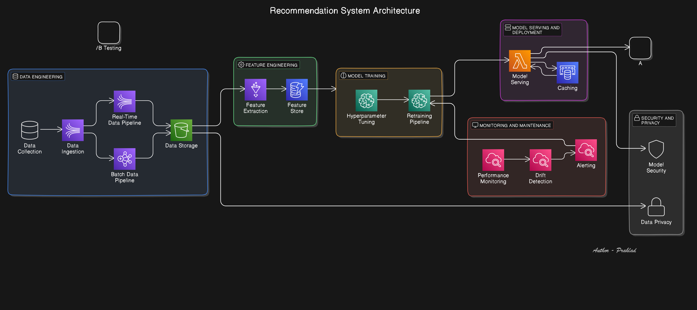

# Case Study: Personalized Content Recommendation System

This case study will walk through building a scalable, real-time recommendation system for a streaming platform (similar to Netflix, Spotify, or YouTube). This kind of system requires end-to-end ML pipelines, from data engineering to deployment and monitoring, so it’s an ideal comprehensive example.

---

---

## System Goals
The recommendation system's goals are:
1. **Real-time Personalization**: Tailor content suggestions for each user based on their preferences, behaviors, and engagement.
2. **Scalability**: Support millions of users with low-latency responses.
3. **Model Accuracy and Freshness**: Keep recommendations relevant by frequently retraining on new data.

---

## System Design Overview

### 1. Data Engineering
- **Data Collection**: Collect a variety of data points—user interactions (likes, views, skips), demographics, and content metadata (genres, themes).
- **Streaming Data Pipeline**: Use Apache Kafka to handle real-time event data and store it in a distributed storage system like Apache Hudi or Delta Lake.
- **Batch Data Pipeline**: For longer-term trends and model retraining, batch processing with Apache Spark can aggregate data.

### 2. Feature Engineering and Feature Store
- **Feature Extraction**: Extract session-based features (e.g., viewing time, interactions per session) and user-level features (e.g., preferred genre, time-of-day preference).
- **Feature Store**: Use a feature store like Feast to manage and serve both real-time and batch features to maintain consistency.

### 3. Model Training Pipeline
- **Model Selection**: Train a collaborative filtering model or a neural network-based approach like a matrix factorization or content-based filtering model.
- **Hyperparameter Tuning**: Use distributed tuning techniques (e.g., Bayesian optimization on Ray Tune) to optimize hyperparameters.
- **Automated Retraining**: Automate retraining based on data drift or set schedules, leveraging Kubeflow Pipelines or TFX to manage this workflow.

### 4. Model Serving and Deployment
- **Serving Architecture**: Deploy models using TensorFlow Serving or TorchServe, with a REST API for real-time inference.
- **Recommendation Cache**: Implement caching for frequently requested recommendations to reduce load.
- **A/B Testing**: Roll out model changes with A/B testing to measure impact before a full release.

### 5. Monitoring and Maintenance
- **Performance Monitoring**: Track response time, throughput, and error rates using Prometheus and Grafana.
- **Drift Detection**: Monitor data and concept drift to maintain accuracy over time. Tools like Evidently AI or AWS SageMaker can be set up for monitoring model drift.
- **Alerting and Retraining Triggers**: Set alerts for significant drops in performance or data distribution shifts. Retraining can be triggered automatically through tools like Airflow or through manual intervention based on these alerts.

### 6. Security and Privacy
- **User Data Privacy**: Apply anonymization and comply with GDPR by minimizing user-specific identifiers and applying differential privacy techniques.
- **Model Security**: Secure API endpoints, and apply rate limiting and monitoring to prevent model exploitation or adversarial attacks.

---

## Challenges Encountered and Solutions

### 1. Scalability
- **Challenge**: Real-time processing for millions of users requires high scalability.
- **Solution**: Distributed systems (Kafka for event streaming, Redis for caching) and cloud-based scaling solutions allow the platform to handle high traffic.

### 2. Latency Constraints
- **Challenge**: Ensuring recommendations are provided within milliseconds.
- **Solution**: Leveraging caching and optimizing the model’s response time by tuning hardware resources (using GPUs) and model architecture (simplified for fast inference).

### 3. Data Drift
- **Challenge**: Model performance degrades as user preferences evolve.
- **Solution**: Implement frequent model retraining and monitor for drift using tools that trigger retraining when necessary.

### 4. Maintaining Consistency of Real-time and Batch Features
- **Challenge**: Real-time and batch features could desynchronize, affecting model consistency.
- **Solution**: Use a centralized feature store to ensure consistent features across training and inference.

---

## Key Takeaways
- **Automation is Key**: Automating data pipelines, retraining, and deployment helps in maintaining model accuracy and system reliability.
- **Monitoring for Drift and Latency**: Keeping track of data drift and model latency ensures recommendations remain relevant and responsive.
- **Scalability Considerations**: Distributed systems and efficient model serving allow for handling millions of users while balancing latency.

---

This case study outlines how different aspects of ML system design fit together in a real-world scenario. 
